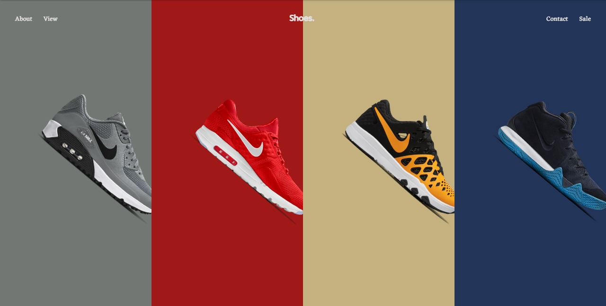

# Shoes Website - Captivating Web Animation Exhibition

Welcome to the Shoes Website GitHub repository! This website is an interactive and captivating web animation exhibition, skillfully crafted to engage audiences with a love for shoes. It showcases various shoe designs and styles with stunning animations using cutting-edge web technologies. The website was built with React, react-router-dom, tailwind css, and framer-motion to deliver a seamless and delightful user experience.

## Live Site

Check out the live website [here](https://shoes-orcin.vercel.app/).

## Features

- Stunning web animations that bring shoes to life.
- Seamless navigation through various shoe designs using react-router-dom.
- Responsive design with Tailwind CSS for an optimal viewing experience on all devices.
- Smooth and engaging animations powered by framer-motion.

